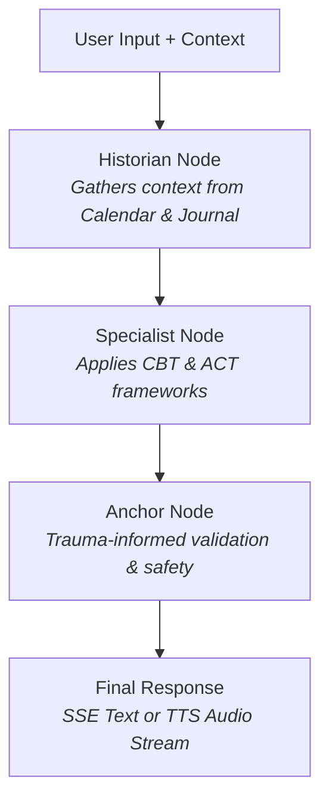

# EmoSync
## Your Privacy-First, Hybrid AI Grief Coach

---

## The Problem
- **Accessibility:** Professional help is often inaccessible, expensive, or has long waitlists.
- **Timing:** Grief and emotional distress don't follow a schedule; people need immediate support.
- **Vulnerability:** Opening up to another human can be intimidating for some.
- **Safety:** Existing generic AI chatbots lack therapeutic guardrails and trauma-informed safety.

---

## The Solution: EmoSync
EmoSync provides 24/7 therapeutic support using evidence-based frameworks. 

- **Multi-modal Support:** Real-time text (SSE) and voice interaction (WebSocket).
- **Therapeutic Grounding:** Incorporates CBT, ACT, and Narrative Therapy.
- **Context-Aware:** Remembers what's important through Journals and Calendar integrations.
- **Safe:** Built-in trauma-informed Anchor layer.

---

## Key Features

- 💬 **Real-time Voice & Text Chat** (Low-latency STT/TTS integration)
- 🧠 **Contextual Memory** (Integration with user Journal and Calendar)
- 📊 **Assessments & Mood Tracking** (PHQ-9, GAD-7 style check-ins)
- 🗺️ **Personalized Action Plans** (Step-by-step coping strategies)
- 🔒 **Privacy-First Design** (Secure local vector storage & JWT Auth)

---

## AI Agent Pipeline (LangGraph)
Our backend runs a highly specialized, 3-node sequential pipeline using Gemini 1.5 Pro:

1. **The Historian:** Pulls context from MCP servers (calendar dates, past journal entries, memories).
2. **The Specialist:** Applies therapeutic frameworks (CBT, ACT) using the Historian's context.
3. **The Anchor:** A strict trauma-informed safety layer that validates emotion, checks for crisis, and ensures the tone is perfect.

---

## High-Level System Architecture

**Frontend (Next.js 15):**
- React App Router, Shadcn UI & Tailwind CSS.
- Real-time audio processing hooks (using MediaRecorder API).
- SSE WebSockets for low-latency Text & Voice streams.

**Backend (FastAPI & Python 3.11):**
- **Unified Endpoints:** Serving both Text and Voice path logic.
- **Voice Pipeline:** Browser Mic `->` FastAPI WebSocket `->` STT/Gemini Live Voice Bridge `->` TTS `->` Speaker.
- **Data Persistence:** PostgreSQL with pgvector capabilities.
- **MCP Servers:** Journal (Semantic Vector Search) & Calendar CRUD.

---

## AI Agent Pipeline Architecture (LangGraph)

---

## Privacy & Emotional Safety

- **No Victim Blaming:** The Anchor node intercepts and prevents toxic positivity.
- **Crisis Detection:** Real-time suicidal ideation detection routes users to 988 Lifeline/Crisis Text Line.
- **Data Ownership:** User journals and calendar context are stored securely.
- **Pacing & Prosody:** Audio responses include dynamic prosody hints to match the user's emotional energy.

---

## What's Next for EmoSync?

1. **Enhanced RAG:** Processing large PDFs (clinical worksheets, customized therapies) into the vector store.
2. **Advanced Biometrics:** Syncing with wearables to detect physiological signs of distress.
3. **Real-time Video:** Adding avatar or video-based non-verbal communication layers.

---

# Thank You
## EmoSync Team
